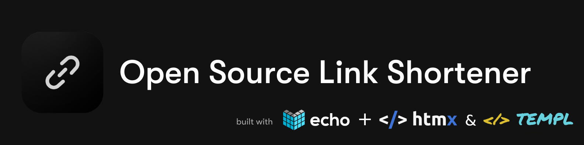

<h1 style="text-align: center;">Shortify</h1>

 

A Full Stack application using Golang's Echo framework & </>htmx.

https://img.shields.io/github/license/emarifer/url-shortener-echo-templ-htmx.svg

## 🤔 What Stack have we used?

In construction... ⚒️